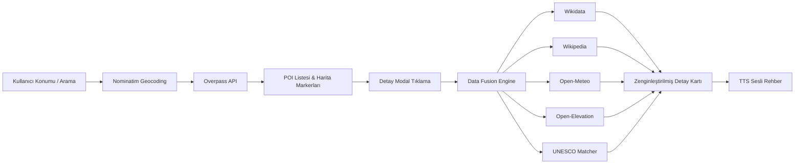

# 🗺️ Altay — Interaktif Tarih & Kültürel Miras Haritası

**Altay**, çevrenizdeki ve dünya genelindeki tarihi eserleri, antik kentleri, müzeleri, kale & surları ve anıtları interaktif harita üzerinde keşfetmenizi sağlayan modern, yüksek performanslı bir Web & PWA uygulamasıdır.


> [an1lbayram](https://an1lbayram-github-io.vercel.app/) tarafından geliştirilmiştir.

---

## ✨ Özellikler

### Harita & Keşif
- **Otomatik GPS Konum Tespiti** — Cihazınızın konumunu kullanarak yakınınızdaki tarihi mekanları anında listeler (varsayılan: İstanbul)
- **Arama & Otomatik Tamamlama** — Şehir, ilçe veya mekan ismi ile hızlı arama (Nominatim Geocoding API)
- **Kategori Filtreleme** — Tümü, Tarihi Eser, Müze, Kale & Sur, Antik Kent, İbadethane, Anıt & Heykel
- **Dinamik Tarama Yarıçapı** — 1 km ile 50 km arasında ayarlanabilir slider
- **Marker Cluster (Kümeleme)** — Yüzlerce mekanı performans kaybı olmadan gösterir
- **Özel SVG Harita İkonları** — Kategori bazlı renkli ve ikonlu özel pinler
- **4 Harita Katmanı** — Sokak Haritası, Esri Uydu Görüntüsü, Topoğrafik (OpenTopoMap), Gece Modu (CARTO Dark)

### Zengin İçerik & Veri Birleştirme
- **Multi-Source Data Fusion Engine** — OSM, Wikidata, Wikipedia, Wikimedia Commons, Open-Meteo, Open-Elevation ve UNESCO verilerini tek bir detay kartında birleştirir
- **Wikipedia Entegrasyonu** — Bölge ve koordinat doğrulamalı Türkçe makale özetleri
- **Wikidata Entegrasyonu** — Yapım yılı, uygarlık, mimar bilgisi ve görseller
- **UNESCO Dünya Mirası Rozeti** — Türkiye'deki UNESCO alanlarını otomatik tanır
- **Canlı Hava Durumu** — Open-Meteo API ile anlık sıcaklık ve hava koşulu
- **Rakım Bilgisi** — Open-Elevation API ile deniz seviyesinden yükseklik
- **Tarihi Künye** — Dönem, mimar, uygarlık, tescil statüsü gibi teknik bilgiler

### Kullanıcı Deneyimi
- **Sesli Rehber (TTS)** — Web Speech API ile Türkçe sesli anlatım
- **Favoriler (Bookmarks)** — Beğendiğiniz mekanları LocalStorage'da saklayın
- **Detay Modal Kartı** — Görsel, açıklama, rozetler, yakındaki eserler ve paylaşım
- **Google Maps Yol Tarifi** — Tek tıkla seçilen mekana yol tarifi
- **Web Share API** — Mekan bilgisini paylaşma veya panoya kopyalama
- **Karanlık / Aydınlık Mod** — Glassmorphism tasarım ve tema desteği
- **PWA & Mobil Uyumlu** — Masaüstü, tablet ve mobilde uygulama gibi çalışır
- **Service Worker** — Network-first stratejisi ile offline destek

---

## 🛠️ Kullanılan Teknolojiler

### Frontend & Build

| Teknoloji | Versiyon | Kullanım |
|-----------|----------|----------|
| [Vite](https://vitejs.dev/) | ^8.1.5 | Build aracı ve geliştirme sunucusu |
| [Tailwind CSS](https://tailwindcss.com/) | ^4.3.3 | Utility-first CSS framework |
| [@tailwindcss/vite](https://tailwindcss.com/) | ^4.0.0 | Vite entegrasyonu |
| [PostCSS](https://postcss.org/) | ^8.5.25 | CSS işleme |
| [Autoprefixer](https://github.com/postcss/autoprefixer) | ^10.5.4 | CSS vendor prefix |
| [Terser](https://terser.org/) | ^5.46.0 | Production minification |

### Harita & Görselleştirme

| Teknoloji | Versiyon | Kullanım |
|-----------|----------|----------|
| [Leaflet.js](https://leafletjs.com/) | ^1.9.4 | İnteraktif harita motoru |
| [Leaflet.markercluster](https://github.com/Leaflet/Leaflet.markercluster) | ^1.5.3 | Marker kümeleme |
| [Font Awesome](https://fontawesome.com/) | ^7.3.1 | İkon seti |
| [Plus Jakarta Sans](https://fonts.google.com/specimen/Plus+Jakarta+Sans) | — | Google Fonts tipografi |

### Harita Tile Sağlayıcıları
- **OpenStreetMap** — Sokak haritası
- **Esri World Imagery** — Uydu görüntüsü
- **OpenTopoMap** — Topoğrafik harita
- **CARTO Dark** — Gece modu haritası

### Veri API'leri (Ücretsiz & Açık Kaynak)

| API | Kullanım |
|-----|----------|
| [Overpass API](https://wiki.openstreetmap.org/wiki/Overpass_API) | OpenStreetMap'ten tarihi POI verileri |
| [Nominatim](https://nominatim.org/) | Geocoding, reverse geocoding, arama |
| [Wikipedia REST API](https://www.mediawiki.org/wiki/API:REST_API) | Makale özetleri ve görseller |
| [Wikidata Entity API](https://www.wikidata.org/wiki/Wikidata:Data_access) | Yapılandırılmış tarihi bilgiler |
| [Wikimedia Commons](https://commons.wikimedia.org/) | Tarihi mekan fotoğrafları |
| [Open-Meteo](https://open-meteo.com/) | Canlı hava durumu |
| [Open-Elevation](https://open-elevation.com/) | Rakım / yükseklik verisi |

### Tarayıcı API'leri
- **Geolocation API** — GPS konum tespiti
- **Web Speech API** — Türkçe text-to-speech sesli rehber
- **Web Share API** — Mekan paylaşımı
- **LocalStorage** — Favoriler, tema, harita katmanı tercihleri
- **Service Worker** — PWA offline desteği

### Deployment
- **[Vercel](https://vercel.com/)** — Hosting ve CI/CD (`vercel.json` ile güvenlik başlıkları)

---

## 🏗️ Proje Mimarisi

```
Altay/
├── index.html              # Uygulama kabuğu (HTML shell)
├── vite.config.js          # Vite yapılandırması
├── tailwind.config.js      # Tailwind tema & renkler
├── postcss.config.js       # PostCSS eklentileri
├── vercel.json             # Vercel deployment & güvenlik başlıkları
├── package.json
│
├── public/
│   ├── favicon.svg         # Uygulama ikonu
│   ├── manifest.json       # PWA manifest
│   └── sw.js               # Service Worker (network-first cache)
│
└── src/
    ├── css/
    │   └── main.css        # Tailwind, Leaflet, FontAwesome importları
    │
    └── js/
        ├── app.js          # Ana giriş noktası, event binding
        ├── state.js        # Merkezi state yönetimi (pub/sub pattern)
        │
        ├── components/
        │   ├── map.js      # Leaflet harita, tile switcher, marker cluster
        │   ├── sidebar.js  # POI listesi & favoriler paneli
        │   ├── modal.js    # Detay kartı modal (data fusion sonuçları)
        │   ├── tts.js      # Text-to-Speech sesli rehber
        │   ├── toast.js    # Bildirim/toast mesajları
        │   └── loader.js   # Yükleme animasyonu
        │
        ├── services/
        │   ├── overpass.js     # Overpass API (4 yedek endpoint)
        │   ├── nominatim.js    # Geocoding & reverse geocoding
        │   ├── wikipedia.js    # Wikipedia REST (bölge/koordinat doğrulama)
        │   ├── wikidata.js     # Wikidata entity detayları
        │   ├── dataFusion.js   # Multi-source veri birleştirme motoru
        │   ├── freeApis.js     # Open-Meteo, Open-Elevation, UNESCO
        │   └── storage.js      # LocalStorage yönetimi
        │
        └── utils/
            ├── helpers.js  # Haversine, debounce, kategoriler, XSS koruması
            └── icons.js    # Özel SVG Leaflet marker ikonları
```

### Veri Akışı



---

## 🚀 Yerel Geliştirme

### Gereksinimler
- **Node.js** 18+ (önerilen: 20 LTS)
- **npm** 9+

### Kurulum

```bash
# 1. Depoyu klonlayın
git clone https://github.com/an1lbayram/Altay.git
cd Altay

# 2. Bağımlılıkları yükleyin
npm install

# 3. Geliştirici sunucusunu başlatın (http://localhost:3000)
npm run dev
```

### Diğer Komutlar

```bash
# Production derlemesi (dist/ klasörüne çıktı)
npm run build

# Production derlemesini yerel önizleme
npm run preview
```

---

## 📦 Production Build

```bash
npm run build
```

Derlenen dosyalar `dist/` klasörüne çıktı olarak verilir. Vite, Leaflet kütüphanesini ayrı bir chunk olarak ayırarak bundle optimizasyonu yapar.

---

## 🌐 Vercel Deployment

1. Projeyi GitHub'a push edin.
2. [Vercel Dashboard](https://vercel.com/dashboard) üzerine gidin.
3. **New Project** butonuna basın ve `Altay` reposunu seçin.
4. Framework Preset: **Vite**
5. Build Command: `npm run build`
6. Output Directory: `dist`
7. **Deploy** butonuna tıklayın.

`vercel.json` dosyası otomatik olarak aşağıdaki güvenlik başlıklarını ekler:
- `X-Content-Type-Options: nosniff`
- `X-Frame-Options: DENY`
- `X-XSS-Protection: 1; mode=block`
- `Referrer-Policy: strict-origin-when-cross-origin`

---

## 📱 PWA Kurulumu

Altay, Progressive Web App olarak tasarlanmıştır:

- Tarayıcıda **"Uygulamayı Yükle"** butonu ile ana ekrana eklenebilir
- `manifest.json` ile standalone mod desteği
- Service Worker ile temel offline erişim (statik asset cache)
- Mobil, tablet ve masaüstünde native uygulama deneyimi

---

## 🔒 Güvenlik

- **XSS Koruması** — Tüm kullanıcı ve API verileri `escapeHtml()` ile sanitize edilir
- **API Cache** — Wikipedia ve Wikidata yanıtları bellek içi cache ile optimize edilir
- **AbortController** — Hızlı arama/kategori değişimlerinde önceki Overpass istekleri iptal edilir
- **Overpass Failover** — 4 farklı endpoint ile yedekli API erişimi

---

## 📄 Lisans

MIT License © 2026 [an1lbayram](https://github.com/an1lbayram)
